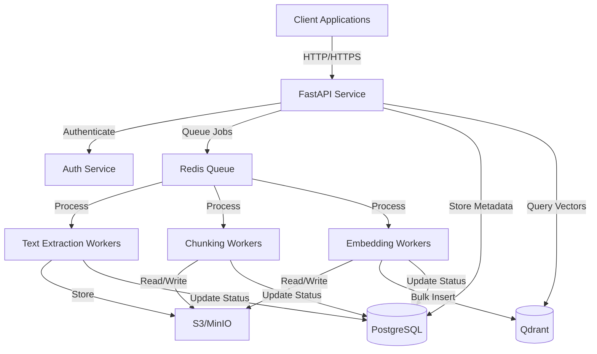
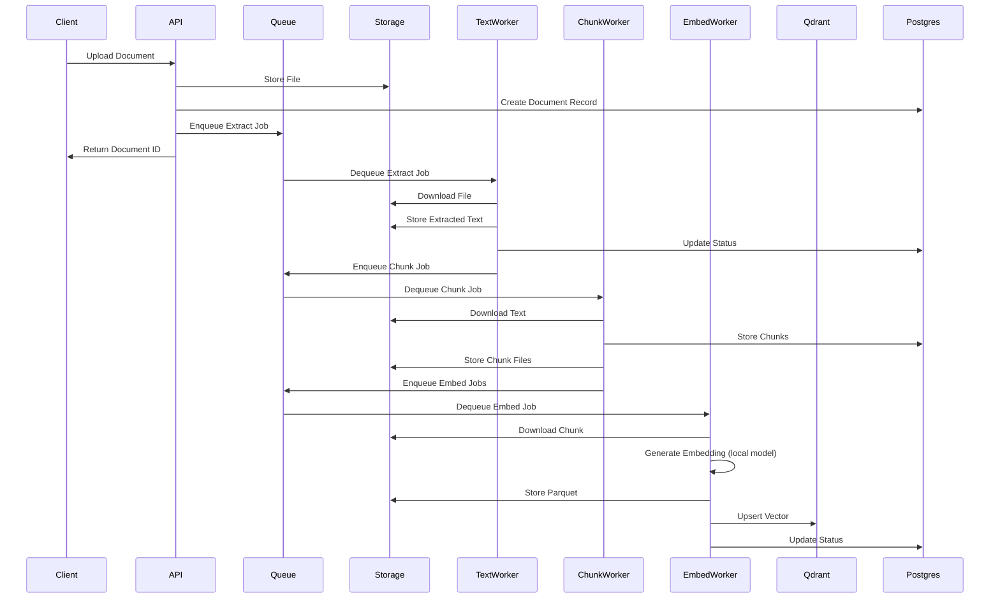
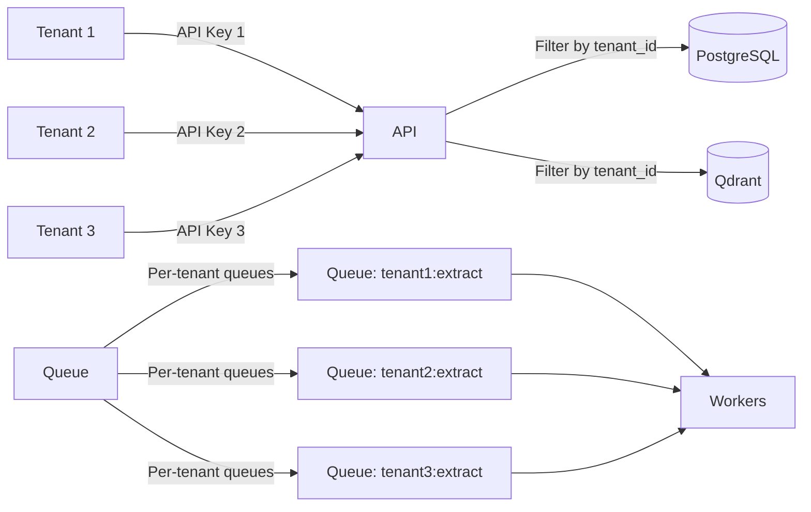

# System Architecture Diagram

## High-Level Architecture

## Processing Pipeline Flow

## Multi-Tenancy Architecture

## Component Details

### API Service
- FastAPI application
- Handles authentication
- Manages file uploads
- Provides search endpoints
- Status tracking

### Workers
- **Text Extractor**: PDF/TXT extraction using pypdf
- **Chunker**: Overlapping semantic chunking with sentence-aware breaking
- **Embedder**: Local embedding generation using sentence-transformers (BAAI/bge-small-en-v1.5)

### Storage
- **PostgreSQL**: Metadata and job tracking
- **Qdrant**: Vector database (384 dimensions with BAAI/bge-small-en-v1.5)
- **MinIO**: Object storage for files and intermediate data (Parquet)
- **Redis**: Job queue with sorted sets for per-tenant fairness
