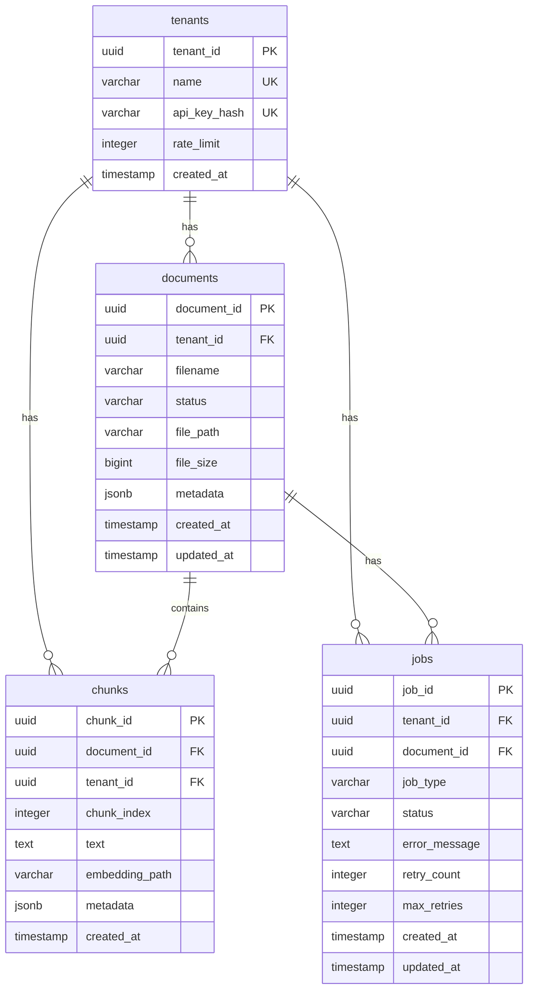
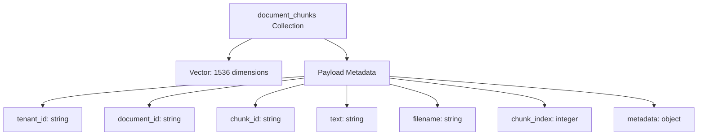
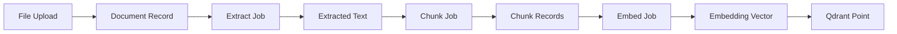

# Entity Relationship Diagram

## PostgreSQL Schema

## Qdrant Collection Structure

## Data Flow Relationships

## Indexes

### PostgreSQL Indexes
- `idx_documents_tenant_id`: On documents(tenant_id)
- `idx_documents_status`: On documents(status)
- `idx_chunks_document_id`: On chunks(document_id)
- `idx_chunks_tenant_id`: On chunks(tenant_id)
- `idx_jobs_tenant_id`: On jobs(tenant_id)
- `idx_jobs_document_id`: On jobs(document_id)
- `idx_jobs_status`: On jobs(status)
- `idx_jobs_type`: On jobs(job_type)

### Qdrant Indexes
- HNSW index on vectors (automatic)
- Payload index on tenant_id (for filtering)
